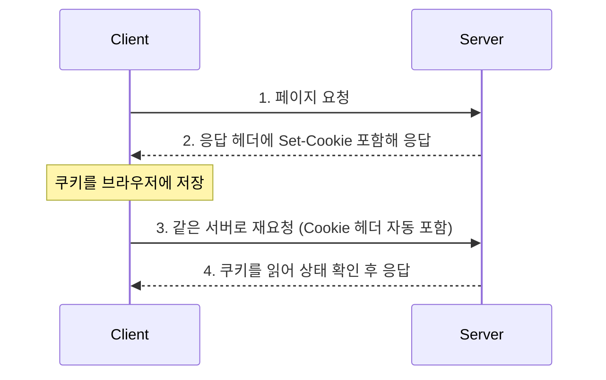
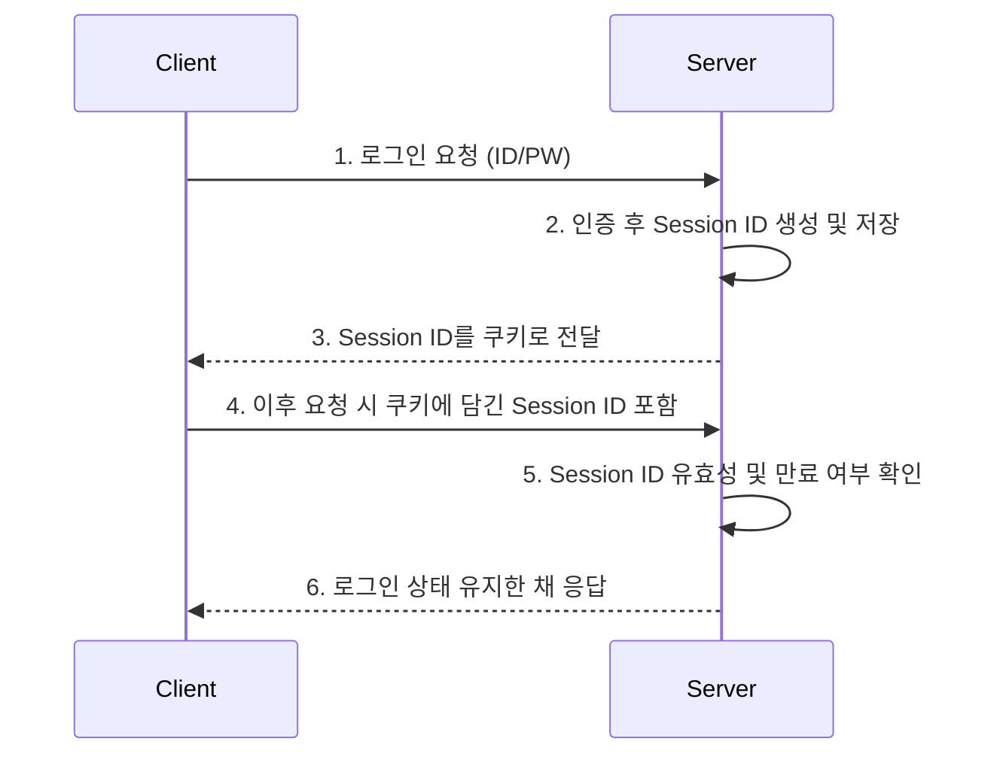

# 쿠키(Cookie) & 세션(Session)

## 학습 목표

- HTTP가 왜 상태를 유지하기 위한 별도 기술(쿠키/세션)을 필요로 하는지 설명할 수 있다.
- 쿠키와 세션의 동작 방식과 차이를 설명할 수 있다.
- 쿠키/세션 방식의 보안 이슈(XSS, CSRF)와 대응 방법을 설명할 수 있다.
- 세션이 서버 확장(scale-out) 환경에서 겪는 문제와 해결 방법을 설명할 수 있다.

---

## 왜 필요한가? (HTTP의 무상태성)

HTTP는 기본적으로 **무상태(Stateless)** 프로토콜이다. 요청을 처리한 후에는 클라이언트와의 연결 정보를 유지하지 않기 때문에, 서버 입장에서는 '방금 로그인한 사용자가 다음 요청을 보낸 사용자와 같은 사람인지' 알 방법이 없다.

이 문제를 해결하기 위해 클라이언트나 서버 어딘가에 상태(로그인 여부 등)를 저장해두는 기술이 필요한데, 그 대표적인 방법이 **쿠키**와 **세션**이다.

> 💡 **면접 포인트**: "쿠키/세션이 왜 필요한가?"라는 질문은 HTTP의 무상태성과 연결지어 답하는 것이 핵심이다.

---

## 쿠키(Cookie)란?

클라이언트의 브라우저에 저장되는 Key-Value 형태의 작은 데이터 조각이다. 서버가 응답 헤더(`Set-Cookie`)로 쿠키를 내려주면, 브라우저가 이를 저장했다가 이후 같은 서버로 요청을 보낼 때마다 자동으로 함께 전송한다.

### 쿠키의 특징

- 주로 사용자의 인증 정보나 세션 ID 등을 저장하는 용도로 사용한다.
- 사용자가 따로 요청하지 않아도, 브라우저가 요청 시 Request Header에 담아 자동으로 서버에 전송한다.
- 클라이언트의 리소스를 사용하기 때문에 서버 부하가 적다.
- 브라우저가 종료돼도 만료 기간이 남아있다면 클라이언트에 계속 보관된다.

### 쿠키의 주요 속성(Attribute)

`Set-Cookie` 헤더에는 값 외에도 아래와 같은 속성을 함께 설정할 수 있다.

| 속성 | 설명 |
| --- | --- |
| `Expires` / `Max-Age` | 쿠키의 만료 시점(설정 없으면 브라우저 종료 시 삭제되는 세션 쿠키가 됨) |
| `Domain` | 쿠키를 전송할 도메인 범위 |
| `Path` | 쿠키를 전송할 경로 범위 |
| `Secure` | HTTPS 연결에서만 쿠키를 전송 |
| `HttpOnly` | JavaScript(`document.cookie`)로 쿠키에 접근하지 못하도록 차단 → XSS로 인한 쿠키 탈취 방지 |
| `SameSite` | 다른 도메인(Cross-Site) 요청에 쿠키를 함께 보낼지 제어 → CSRF 방지에 활용 |

> 💡 **면접 포인트**: `HttpOnly`와 `SameSite`는 실무·면접에서 가장 자주 나오는 쿠키 보안 속성이다. `HttpOnly`는 XSS 방어, `SameSite`는 CSRF 방어와 연결지어 기억해두면 좋다.

### 쿠키의 동작 방식

1. 클라이언트가 페이지를 요청한다.
2. 서버가 쿠키를 생성해 `Set-Cookie` 헤더에 담아 응답한다.
3. 브라우저는 만료 기간이 남은 쿠키를 계속 보관한다.
4. 같은 서버로 재요청할 때 `Cookie` 헤더에 담아 자동으로 전송한다.
5. 서버는 필요 시 쿠키 값을 갱신해 다시 응답한다.

### 쿠키 사용 예시

- 팝업창 '오늘 이 창을 다시 보지 않기'
- 로그인 시 아이디 자동 입력
- 세션 ID, 장바구니 정보 등 저장

---

## 세션(Session)이란?

서버 측에서 사용자의 상태를 저장·관리하며, 로그인한 유저를 식별하기 위해 사용하는 기술이다.

### 세션의 특징

- 실제 데이터는 서버(또는 별도 저장소)에 저장되고, 클라이언트에는 이를 식별할 **Session ID**만 전달된다.
- 민감한 데이터가 클라이언트에 노출되지 않기 때문에 쿠키에 비해 보안성이 좋다.
- 서버의 리소스를 사용하므로, 세션이 많아지면 서버 성능에 부담을 줄 수 있다.
- 일반적으로 로그인 상태 유지에 사용된다.

### 세션의 동작 방식

1. 유저가 로그인에 성공하면, 서버는 유저를 식별할 Session ID를 생성해 서버 측 저장소(메모리, DB, Redis 등)에 저장한다.
2. 서버는 유저에게 Session ID를 전달하고, 유저는 이를 쿠키로 저장한다.
3. 이후 요청마다 쿠키에 담긴 Session ID가 함께 전송된다.
4. 서버는 전달받은 Session ID가 유효한지(만료 여부 포함) 확인한다.
5. 문제가 없다면 로그인 상태를 유지한 채 요청을 처리해 응답한다.

> ⚠️ 세션 저장소에는 보통 사용자 식별자(예: user id)와 로그인 상태 정보만 저장하며, 비밀번호와 같은 민감 정보를 직접 저장하지는 않는다.

### 세션과 서버 확장(Scale-out) 문제

서버를 여러 대로 확장하면, 로그인 시 세션을 생성한 서버와 이후 요청을 처리하는 서버가 다를 수 있어 세션 불일치 문제가 발생한다. 이를 해결하는 대표적인 방법은 다음과 같다.

| 방법 | 설명 |
| --- | --- |
| Sticky Session | 로드밸런서가 같은 클라이언트의 요청을 항상 같은 서버로 보냄 |
| Session Clustering | 여러 서버가 세션 데이터를 서로 복제·동기화 |
| 세션 저장소 분리 | Redis 등 외부 저장소에 세션을 두고 모든 서버가 공유 (가장 널리 쓰이는 방식) |

> 💡 **면접 포인트**: "세션 방식은 서버를 확장하기 어렵다"는 단점이 실무에서 자주 언급되며, 이때 해결책으로 Redis 기반 세션 스토어를 함께 답하면 좋은 인상을 줄 수 있다.

### 세션 사용 예시

- 화면을 이동해도 로그아웃 전까지 로그인 상태 유지

---

## 쿠키와 세션 비교

| 구분 | Cookie | Session |
| --- | --- | --- |
| 저장 위치 | Client(브라우저) | Server |
| 저장 형식 | Text | Object |
| 만료 시점 | 쿠키 저장 시 설정(없으면 브라우저 종료 시) | 서버 정책에 따름(Timeout 등) |
| 리소스 부담 | 클라이언트 | 서버 |
| 보안성 | 상대적으로 낮음(클라이언트에 값 노출) | 상대적으로 높음(서버에서 관리) |
| 용량 제한 | 도메인당 약 20개, 쿠키당 약 4KB | 제한 없음(서버 저장소에 따라 다름) |

---

## 보안 이슈

- **XSS(Cross-Site Scripting)**: 악성 스크립트가 `document.cookie`로 쿠키 값을 탈취할 수 있다. → `HttpOnly` 속성으로 방어.
- **CSRF(Cross-Site Request Forgery)**: 사용자가 의도하지 않은 요청에 쿠키(세션 ID)가 자동으로 실려 위조 요청이 성공할 수 있다. → `SameSite` 속성, CSRF 토큰으로 방어.
- **세션 하이재킹**: Session ID가 노출되면 공격자가 이를 그대로 사용해 다른 사용자인 척 요청할 수 있다. → `Secure` 속성(HTTPS 강제), 세션 만료 시간 단축 등으로 완화.

---

## 토큰(Token) 기반 인증

토큰은 쿠키-세션과는 원리가 다른 인증 방식이다. 서버가 상태(세션)를 직접 저장하지 않고, 클라이언트가 들고 있는 토큰 자체에 검증 가능한 서명이 담겨 있어 서버는 서명만 검증하면 된다.

- 세션 방식은 안전하지만 사용자 수만큼 서버에 저장 공간이 필요하고 확장이 까다롭다.
- 토큰 방식은 서버가 별도로 상태를 저장하지 않아도(Stateless) 되므로 서버 부하와 확장성 측면에서 유리하다.
- 다만 한 번 발급된 토큰은 만료 전까지 서버가 강제로 무효화하기 어렵다는 단점이 있다(Access/Refresh Token 조합, 블랙리스트 등으로 보완).

### 토큰은 어디에 담아 전송하는가?

| 위치 | 방식 | 특징 |
| --- | --- | --- |
| 헤더 | `Authorization: Bearer {token}` | 클라이언트 코드가 직접 담아 전송(자동 전송 X) → **CSRF에 안전**, 대신 JS로 토큰을 다루므로 저장소(localStorage 등)가 **XSS에 노출**되면 탈취될 수 있음 |
| 쿠키 | `Set-Cookie`로 전달, 이후 자동 전송 | `HttpOnly` 설정 시 **XSS에 안전**, 대신 자동 전송 특성 때문에 **CSRF에 취약**(`SameSite`로 보완) |
| 바디 | 요청 바디에 포함 | 매 요청 인증 용도로는 부적합(GET/DELETE 등 바디 없는 요청 존재) → 주로 **로그인 응답으로 토큰을 발급**할 때 사용 |

> 💡 **면접 포인트**: "헤더 vs 쿠키" 대비 축으로 정리하면 좋다 => **헤더는 CSRF에 강하고 XSS에 약함, 쿠키(+HttpOnly)는 XSS에 강하고 CSRF에 약함**. 실무에서는 Access Token은 헤더, Refresh Token은 HttpOnly 쿠키로 나눠 쓰는 방식도 자주 언급된다.

---

## 참고 자료

- [웹 인증: Cookie, Session, Token 쉽게 개념 및 특징 정리 (jibinary 블로그)](https://jibinary.tistory.com/entry/%EC%9B%B9-%EC%9D%B8%EC%A6%9D-Cookie-Session-Token-%EC%89%BD%EA%B2%8C-%EA%B0%9C%EB%85%90-%EB%B0%8F-%ED%8A%B9%EC%A7%95-%EC%A0%95%EB%A6%AC-%EC%BF%A0%EA%B8%B0-%EC%84%B8%EC%85%98-%ED%86%A0%ED%81%B0)
